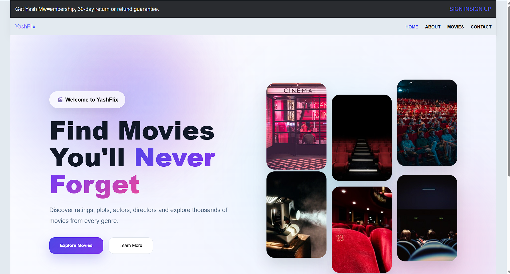
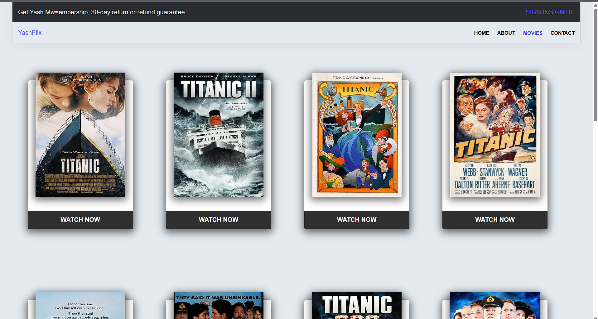

# 🎬 YashFlix - React Router Movie Website

A modern Movie Information Web Application built using **React.js** and **React Router**. This project was developed during my **Second Year (2nd Semester)** while learning React Router concepts such as client-side routing, dynamic routes, navigation, and custom error handling.

The application allows users to browse movies, navigate between pages, open detailed information for a selected movie, and experience a smooth loading animation before viewing movie details.

---

## 🚀 Features

- 🏠 Beautiful Landing/Home Page
- 🎬 Browse Movie Collection
- 📄 Dynamic Movie Details Page
- ⚡ Loading Animation while opening movie details
- 🧭 Client-side Routing using React Router
- 🔗 Dynamic Routes using URL Parameters
- 🚫 Custom 404 Error Page
- 📱 Responsive User Interface
- 🎨 Clean and Modern UI Design
- 📂 Component-Based Architecture

---

## 🛠️ Technologies Used

- React.js
- React Router DOM
- JavaScript (ES6+)
- HTML5
- CSS3
- Vite

---

## 📚 React Concepts Used

- Functional Components
- React Router DOM
- BrowserRouter
- Routes
- Route
- NavLink
- Link
- useParams()
- useNavigate()
- React Hooks
- Component Reusability
- Dynamic Routing
- Conditional Rendering
- Loading State
- Error Page Routing

---

## 📷 Screenshots

### 🏠 Home Page



---

### 🎬 Movies Page



---

### 📄 Movie Details Page


---

### 🚫 Custom 404 Error Page


---

## 📁 Project Structure

```text
src/
│
├── components/
├── pages/
├── assets/
├── App.jsx
├── main.jsx
└── index.css
```

---

## ⚙️ Installation

Clone the repository

```bash
git clone https://github.com/YOUR_USERNAME/YOUR_REPOSITORY.git
```

Navigate into the project folder

```bash
cd YOUR_REPOSITORY
```

Install dependencies

```bash
npm install
```

Start the development server

```bash
npm run dev
```

---

## 🎯 Learning Outcomes

Through this project I learned:

- Creating Single Page Applications (SPA)
- Navigation using React Router
- Dynamic URL Routing
- Passing Parameters using URL
- Managing Components
- Building Responsive Layouts
- Creating Custom Error Pages
- Implementing Loading Screens
- Organizing React Projects

---

## 🔮 Future Improvements

- Search Movies
- Genre Filter
- Pagination
- Dark Mode
- Favorites/Watchlist
- User Authentication
- Responsive Improvements
- Backend Integration

---

## 👨‍💻 Developer

**Yash Satpute**

Computer Engineering Student

Currently learning:

- React.js
- Full Stack Development
- IoT
- Machine Learning

---

## ⭐ Project Highlights

✔ Modern React UI

✔ React Router Navigation

✔ Dynamic Movie Details

✔ Loading Animation

✔ Custom 404 Error Page

✔ Responsive Design

✔ Beginner-Friendly React Project

---

If you like this project, don't forget to ⭐ the repository!
